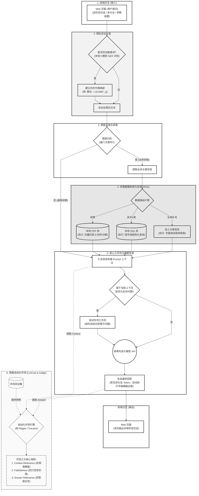

```mermaid
%%{init: {'flowchart': {'curve': 'linear'}}}%%
graph TD
    %% 定义全局黑白/灰度样式
    classDef frontend fill:#ffffff,stroke:#000000,stroke-width:2px;
    classDef security fill:#f2f2f2,stroke:#000000,stroke-width:2px;
    classDef ai fill:#ffffff,stroke:#000000,stroke-width:2px;
    classDef data fill:#e6e6e6,stroke:#000000,stroke-width:2px;
    classDef eval fill:#fafafa,stroke:#333333,stroke-width:2px,stroke-dasharray: 5 5;

    subgraph FrontEnd_In ["1. 前端交互 (输入)"]
        UI_In["Web 页面 (用户提问)<br/>(含历史对话 / 多分支 / 参数设置)"]
    end

    subgraph Security ["2. 隐私安全沙盒"]
        SecCheck{"是否存在敏感词?<br/>(本地小模型 NER 识别)"}
        Mask["建立内存字典映射<br/>(例: 腾讯 -> [COMP_1])"]
        SafeQuery["安全处理后文本"]
    end

    subgraph LangChainCore ["3. 意图分类与调度"]
        IntentClassifier{"意图识别<br/>(属六大类吗?)"}
        NER_Biz["提取业务关键字段"]
    end

    subgraph DataRetrieval ["4. 多路数据检索与处理 (RAG)"]
        Route{"数据路由引擎"}
        
        PDF[("本地 PDF 库<br/>(执行: 向量匹配 & 树形分解)")]
        SQL[("本地 SQL 库<br/>(执行: 按字段结构化查询)")]
        WebData["线上关键信息<br/>(执行: 专属爬虫程序提取)"]
    end

    subgraph LLM_Gen ["5. 核心工作流与模型生成"]
        Merge["汇总信息构建 Prompt 上下文"]
        HardCheck{"基于当前上下文<br/>是否为复杂问题?"}
        ComplexFlow["启动专项工作流<br/>(按先验知识拆解子问题)"]
        API_LLM(("调用先进大模型 API"))
        
        FinalResponse["生成最终回答<br/>(若包含化名 Token，自动执行字典精确还原)"]
    end

    subgraph FrontEnd_Out ["前端交互 (输出)"]
        UI_Out["Web 页面<br/>(流式输出并保存至历史)"]
    end

    subgraph Evaluation ["6. 旁路自动化评测 (LLM-as-a-Judge)"]
        EvalDB[("评测测试集")]
        EvalEngine{"自动化评测引擎<br/>(如 Ragas / TruLens)"}
        Metrics["评估三大核心指标:<br/>1. Context Relevance (检索准确度)<br/>2. Faithfulness (抗幻觉忠实度)<br/>3. Answer Relevance (回答相关性)"]
    end

    %% --- 核心执行流连线 ---
    UI_In --> SecCheck
    
    SecCheck -- 是 --> Mask --> SafeQuery
    SecCheck -- 否 --> SafeQuery
    
    SafeQuery --> IntentClassifier
    
    IntentClassifier -- "是 (业务领域)" --> NER_Biz --> Route
    IntentClassifier -- "否 (通用闲聊)" --> Merge
    
    %% 并发数据路由分支 (节点精简后，垂直高度缩减)
    Route -->|政策| PDF --> Merge
    Route -->|其余5类| SQL --> Merge
    Route -->|全域补充| WebData --> Merge
    
    Merge --> HardCheck
    HardCheck -- "是" --> ComplexFlow --> API_LLM
    HardCheck -- "否" --> API_LLM
    
    API_LLM --> FinalResponse
    FinalResponse --> UI_Out

    %% --- 自动化评测体系的旁路连线 ---
    EvalDB -.-> |提供用例| EvalEngine
    Merge -.-> |"提取 Context"| EvalEngine
    FinalResponse -.-> |"提取 Answer"| EvalEngine
    EvalEngine --> Metrics

    %% --- 应用样式 ---
    class FrontEnd_In,UI_In,FrontEnd_Out,UI_Out frontend;
    class Security,SecCheck,Mask,SafeQuery security;
    class LangChainCore,IntentClassifier,NER_Biz ai;
    class DataRetrieval,Route,PDF,SQL,WebData data;
    class LLM_Gen,Merge,HardCheck,ComplexFlow,API_LLM,FinalResponse ai;
    class Evaluation,EvalDB,EvalEngine,Metrics eval;
```